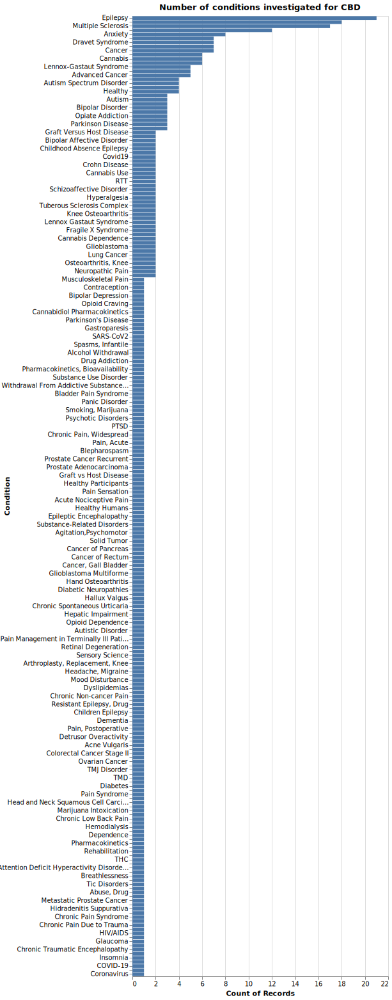

# count_cbd_clin_trial
fetch clinical trial data about cannabidiol (CBD) using an API query of the clinicaltrials.gov website

CBD (Epidiolex) is claimed to be therapeutic in a wide array of diseases, arguably more than any other FDA-approved drug. One way to demonstrate this is by searching [ClinicalTrials.gov](https://clinicaltrials.gov/) for 'cannabidiol'. This code snippet uses an API query to ping clinicaltrials.gov for this search, parses the results and graphs the number of clinical trials per condition. 

